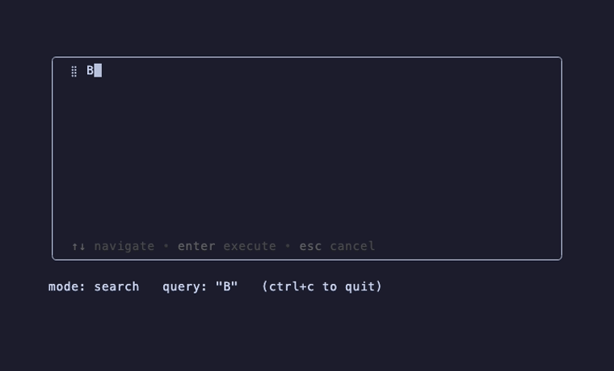

# palette/advanced



Three modes side-by-side, demonstrating sync vs. async dispatchers
and per-mode debouncing.

| Prefix | Mode | Behaviour |
|--------|------|-----------|
| `>` | `palette.CommandMode` | Sync. Filters local commands; Enter dispatches `Command.Run`. |
| `@` | custom `filesMode` | Sync, no debounce. Each keystroke re-filters this repo's real file list inline. |
| _(none)_ | custom `searchMode` (overrides `palette.SearchMode`) | Async. 100 ms debounce + 100 ms simulated round-trip against a fake web-page corpus. Prompt glyph (`◌`) swaps to a spinner while the search is in flight. |

The mode list passed to `WithModes` is priority-ordered — first
`Match` to return true wins. `searchMode` is last and has `Match:
nil`, so it catches anything not claimed by `>` or `@`.

## Run

```sh
go run .
# or, from the repo root:
task example NAME=palette/advanced
```

## Regenerate the GIF

```sh
task demo NAME=palette/advanced
```
