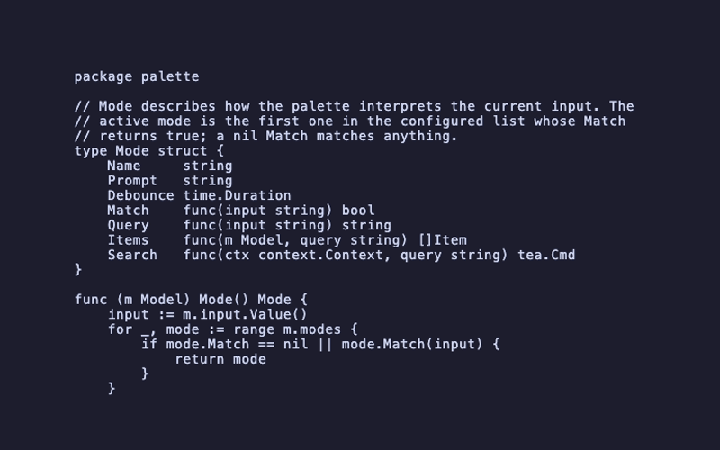

# palette/overlay



The palette rendered as a **modal overlay** over a background model,
composited with `lipgloss.Canvas`. This is the recipe most real
applications will want — a command palette that pops in and out over
existing UI rather than owning the whole terminal.

## Key choices

- **Fixed palette width** — `p.SetWidth(60)` pins the palette to 60
  cells regardless of terminal size; the host centres it inside the
  terminal via `Layer.X((width - 60) / 2)`.
- **Visibility toggle** — `ctrl+k` flips a `visible` bool. While
  hidden, all key events fall through to the background (here a
  static fake-editor buffer; in a real app, your own model). While
  visible, only the palette sees keystrokes.
- **Auto-close on dispatch** — when the host model receives a
  `palette.SelectedMsg`, it sets `visible = false`, calls `Blur()`
  and `Reset()`, then forwards the message. Selecting an item closes
  the palette in one keystroke (Enter) instead of two.
- **Alt-screen** — the host sets `view.AltScreen = true` so the
  background doesn't smear over the user's shell history.

## Compositing

```go
canvas := lipgloss.NewCanvas(width, height)
canvas.Compose(lipgloss.NewLayer(background))
canvas.Compose(
    lipgloss.NewLayer(palette.View()).
        X((width - paletteWidth) / 2).
        Y(height / 6),
)
return tea.NewView(canvas.Render())
```

## Run

```sh
go run .
# or, from the repo root:
task example NAME=palette/overlay
```

## Regenerate the GIF

```sh
task demo NAME=palette/overlay
```
