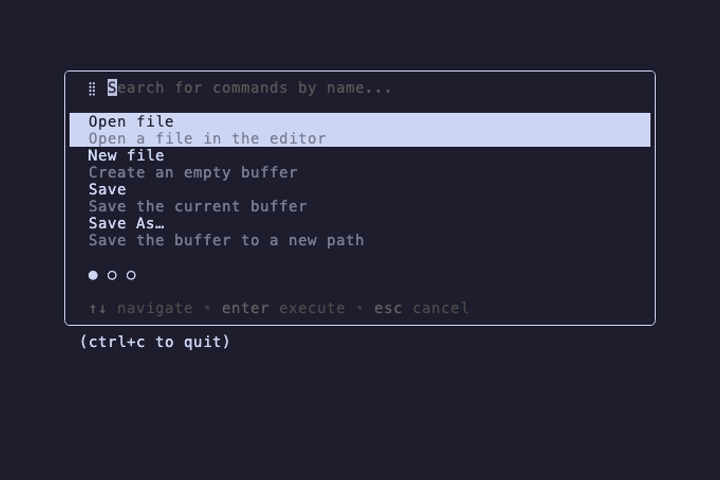

# palette/simple



The minimal `foam/palette` setup: **one mode**, no prefixes, fuzzy
filter as you type.

## What's here

- A single `palette.Mode` with `Match: nil` (catch-all) and an
  `Items` closure that calls `palette.FilterFuzzy(m.Commands(), q)`.
- Five `palette.Command`s, one of which (`Quit`) sets `Run: tea.Quit`
  so Enter actually exits.
- Standard ↑/↓ navigation, Enter to dispatch, ctrl+c to bail.

## Run

```sh
go run .
# or, from the repo root:
task example NAME=palette/simple
```

## Regenerate the GIF

```sh
task demo NAME=palette/simple
```
